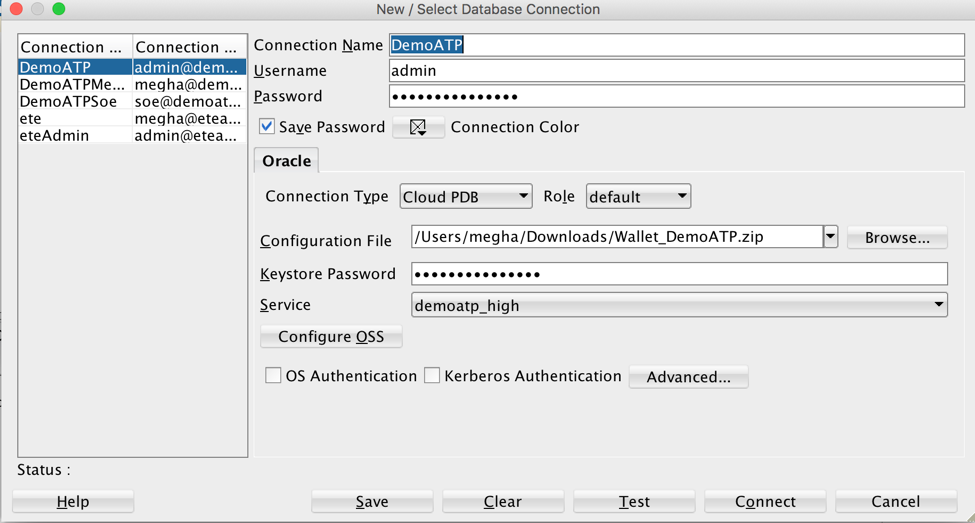
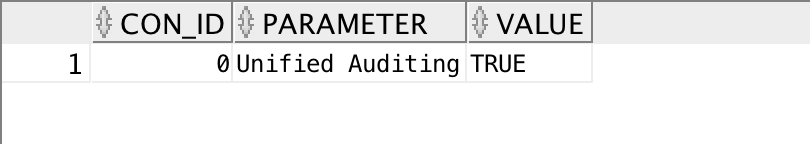
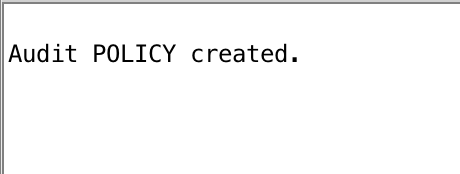
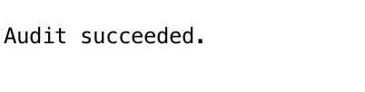
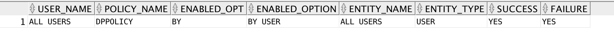
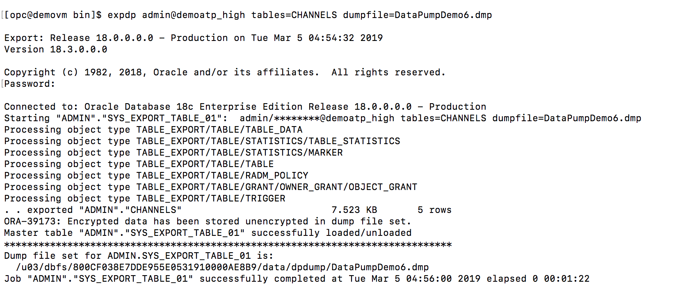
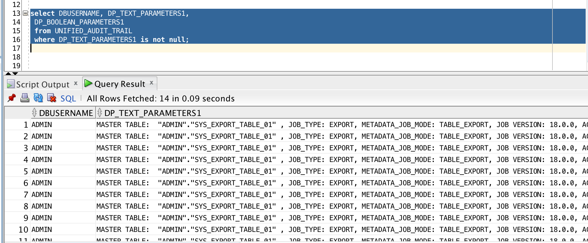

Updated: December 10, 2018

## Introduction

You can audit the several types of activities, using unified audit policies and the AUDIT SQL statement.
All audit records are written to the unified audit trail in a uniform format and are made available through the UNIFIED_AUDIT_TRAIL view.
The unified audit trail captures audit information from many types of object, from SQL statements to other Oracle Database Components, such as Data Pump, SQL*Loader etc.

## Objectives

The objective of this lab is to create an audit policy for the datapump export and then to query UNIFIED_AUDIT_TRAIL to view the generated audit records. 

We will do the following:
 - Create an audit policy for datapump export.
 - Enable the policy and apply audit settings to one or more users.
 - View the generated audit records.

## Objectives

You need to have a connection to database through admin. 

Open up your SQL Developer and create a new connection for admin. If you already have a connection, skip this step. 

Enter the following details for admin:

1.	Connection Name: DemoATP
2.	Username: admin
3.	Password: Password you entered while creating database on cloud.
4.	Connection Type: Cloud PDB
5.	Configuration File: Path to your wallet
6.	Keystore Password: Password entered while downloading wallet. 

###  **STEP 1**: Create an audit policy for datapump export.

- Unified Auditing is enabled by default. In order to check that enter the following in your SQL Workbench:
  
  **select con_id,parameter,value from v$option where parameter = 'Unified Auditing';**
  
  
  
- Type the following SQL statement to create audit policy:
   
   **CREATE AUDIT POLICY dppolicy ACTIONS COMPONENT=datapump export;**
    
    You should see this output
    
  
    

###  **STEP 2**: Enable the policy and apply audit settings to one or more users.

- Type the following SQL statement in SQL Workbench:

    **AUDIT POLICY dppolicy;**. 

- The output should be **Audit succeeded**
   
     

- When unified auditing is enabled in Oracle Database, the audit records are populated in this new audit trail. 
This view displays audit records in tabular form by retrieving the audit records from the audit trail.

    Be aware that if the audit trail mode is QUEUED, then audit records are not written to disk until the in-memory queues are full. The following procedure explicitly flushes the queues to disk, so that you can see the audit trail records in the UNIFIED_AUDIT_TRAIL view:

    **EXEC SYS.DBMS_AUDIT_MGMT.FLUSH_UNIFIED_AUDIT_TRAIL;**

###  **STEP 3**: View the generated audit records.

- The COLUMN FORMAT value allows 15 characters to accommodate user_name and policy_name in the results.

    **col user_name format A15**

    **col policy_name format A15**
    
- Check if policy exist:
    
    **SELECT * FROM AUDIT_UNIFIED_ENABLED_POLICIES where POLICY_NAME like 'DPPOLICY';**
    
    Output should be as follows:
    
     
    
- Run the following SQL command in SQL Workbench. This will show you all the sudit records for audit type Datapump:

    **select DBUSERNAME, DP_TEXT_PARAMETERS1,
 DP_BOOLEAN_PARAMETERS1
 from UNIFIED_AUDIT_TRAIL
 where DP_TEXT_PARAMETERS1 is not null;**

- Go ahead and run the export command again

    
    
- Run the following command again:

    **select DBUSERNAME, DP_TEXT_PARAMETERS1,
 DP_BOOLEAN_PARAMETERS1
 from UNIFIED_AUDIT_TRAIL
 where DP_TEXT_PARAMETERS1 is not null;**
 
     

    